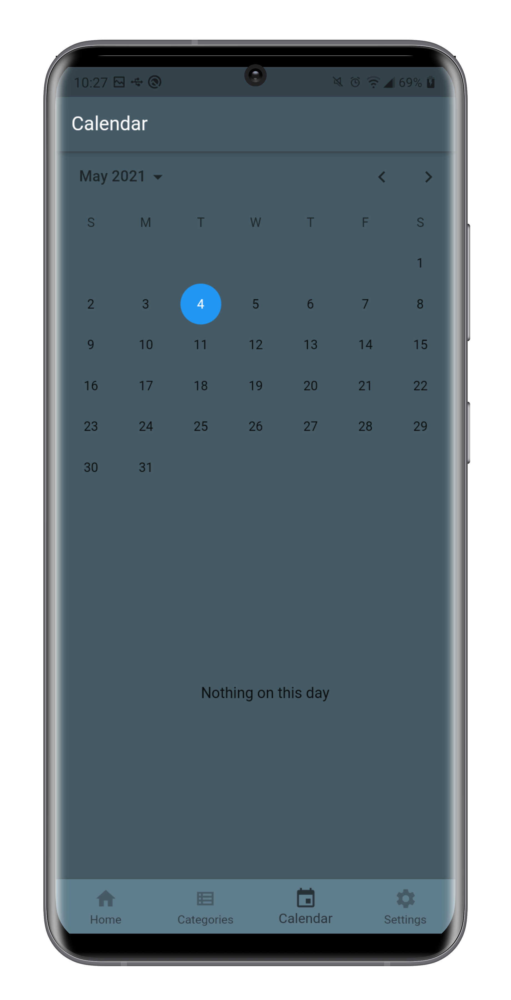
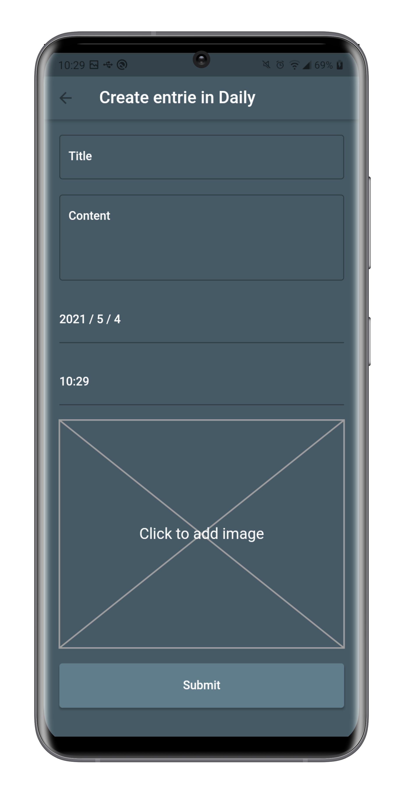

<h1 align="center"> whatidid </h1>

<p align="center">
  <a href="https://github.com/ErickLuizA/whatidid/graphs/commit-activity" alt="Maintenance">
    
  </a>

  <a href="./LICENSE" alt="License: MIT">
    
  </a>

<br/>


<a href="https://github.com/ErickLuizA/whatidid/stargazers">
  
</a>

<p align="center">
  <a href="#clipboard-description">Description</a>&nbsp;&nbsp;&nbsp;|&nbsp;&nbsp;&nbsp;
  <a href="#building_construction-technologies">Technologies</a>&nbsp;&nbsp;&nbsp;|&nbsp;&nbsp;&nbsp;
  <a href="#rocket-getting-started">Getting Started</a>&nbsp;&nbsp;&nbsp;|&nbsp;&nbsp;&nbsp;
  <a href="#memo-license">License</a>|&nbsp;&nbsp;&nbsp;
  <a href="#framed_picture-screenshots">Screenshots</a>
</p>


## :clipboard: Description

whatidid is a diary app built with flutter


## :building_construction: Technologies

- [Flutter](https://flutter.dev/)
  - [shared_preferences](https://pub.dev/packages/shared_preferences)
  - [equatable](https://pub.dev/packages/equatable)
  - [flutter_svg](https://pub.dev/packages/flutter_svg)


## :rocket: Getting Started

## 1. Download the repository

```shell
 $ git clone https://github.com/ErickLuizA/whatidid.git
  
  or 

 $ gh repo clone ErickLuizA/whatidid
```

## 2. Installation

```shell
# Go into the repository
$ cd whatidid

# Install dependencies
$ flutter pub get 

# or just use your IDE
```

## 3. Execution

```shell
$ flutter run

# or just use your IDE
```

## :framed_picture: Screenshots

<div>
  
  
  
  
  
  
  
  
  
</div>

## :information_source: TODO
  - Tests
  - Add notifications
  - Edit option

## :memo: License


This project is under the MIT license. See the file [LICENSE](LICENSE) for more details.

---

Build with 💙 By [Erick](https://www.linkedin.com/in/erick-luiz-47151a1a4/)
